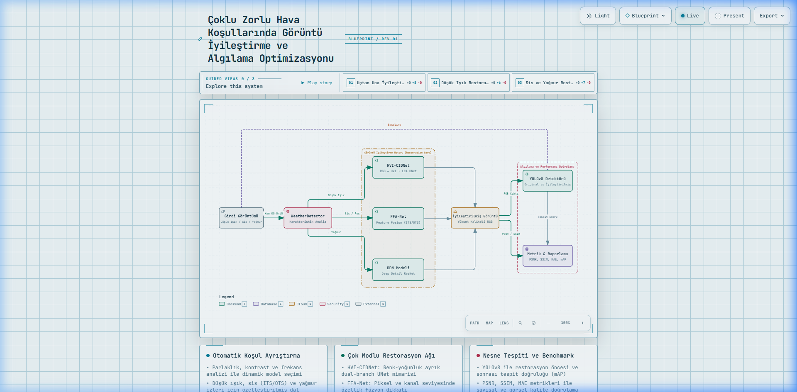
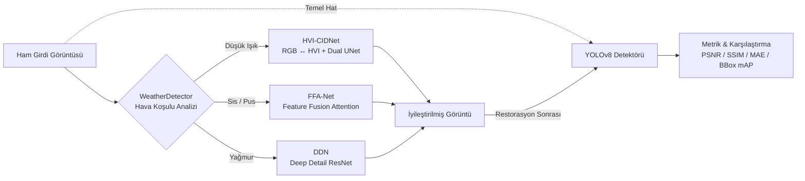
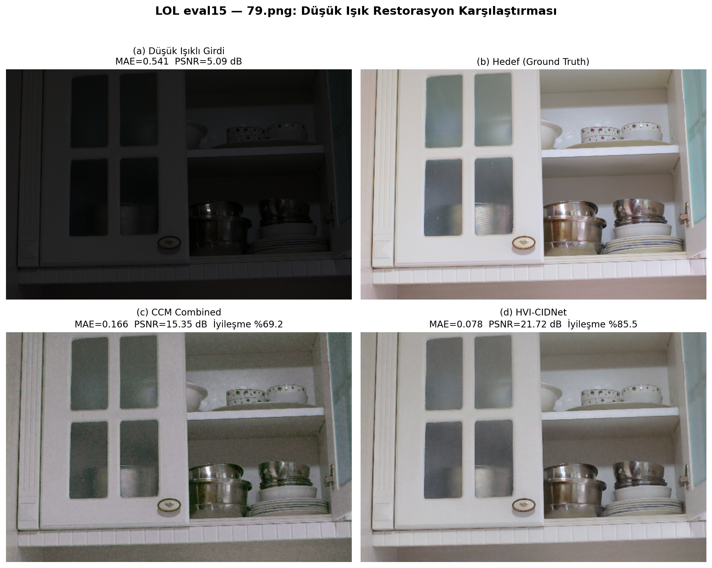

# Çoklu Zorlu Hava Koşullarında Görüntü İyileştirme ve Algılama Optimizasyonu

Bu proje; düşük ışık, sis/pus ve yağmur gibi zorlu atmosferik koşullar altında bozulmaya uğramış görüntüleri derin öğrenme tabanlı özelleştirilmiş restorasyon modelleriyle iyileştiren, iyileştirilmiş görüntüler üzerinde **YOLOv8** nesne tespit başarımını optimize eden ve tüm süreci nicel/nitel metriklerle değerlendiren uçtan uca bir araştırma ve uygulama çerçevesidir.

---

## 📌 İçindekiler
- [Genel Bakış](#-genel-bakış)
- [Sistem Mimarisi ve Veri Akışı](#-sistem-mimarisi-ve-veri-akışı)
- [Desteklenen Modeller ve Yöntemler](#-desteklenen-modeller-ve-yöntemler)
- [Benchmark ve Deneysel Sonuçlar](#-benchmark-ve-deneysel-sonuçlar)
- [Görsel Karşılaştırmalar](#-görsel-karşılaştırmalar)
- [Dizin Yapısı](#-dizin-yapısı)
- [Kurulum](#-kurulum)
- [Kullanım Rehberi](#-kullanım-rehberi)
- [Kaynakça ve İlgili Yayınlar](#-kaynakça-ve-ilgili-yayınlar)

---

## 🔬 Genel Bakış

Otonom sürüş, güvenlik kameraları ve robotik görüş sistemleri, zorlu çevre şartlarında (gece, yoğun sis, sağanak yağış) ciddi performans kayıpları yaşar. Bu projede:
1. **Dinamik Karakteristik Ayrıştırma:** Girdi görüntüsünün parlaklık, kontrast ve frekans özellikleri `WeatherDetector` modülüyle analiz edilerek uygun restorasyon dalı belirlenir.
2. **Çok Modlu Restorasyon:**
   - **Düşük Işık:** HVI renk uzayı tabanlı dual-branch `HVI-CIDNet` modeli.
   - **Sis / Pus:** Özellik füzyon ve piksel/kanal dikkat mekanizmalı `FFA-Net` (ITS & OTS).
   - **Yağmur:** Yüksek frekans detay ayrıştırma tabanlı `DDN` (Deep Detail Network).
3. **Aşağı Akış (Downstream) Algılama:** Restorasyon öncesi ve sonrasında `YOLOv8` nesne tespiti yapılarak mAP, tespit sayısı ve sınıf güven skorlarındaki artış hesaplanır.
4. **Kapsamlı Değerlendirme:** PSNR, SSIM, MAE, UIQI ve tespit artış oranları hem tablo hem de görsel karşılaştırmalarla raporlanır.

---

## 🏗 Sistem Mimarisi ve Veri Akışı

Aşağıda sistemin uçtan uca çalışma akışı ve bileşen etkileşimleri yer almaktadır:



> 🌐 **İnteraktif Görünüm:** Katmanlar arası ilişkileri keşfetmek, canlı tema değiştirmek ve detaylı görünümleri incelemek için [Archify İnteraktif Mimari Sayfasını](docs/assets/pipeline_architecture.html) tarayıcınızda açabilirsiniz.



### Boru Hattı (Pipeline) Aşamaları
1. **Giriş ve Ön İşleme:** Görüntü RGB formatında normalize edilir ve tensöre dönüştürülür.
2. **Koşul Tespiti (Weather Routing):** Ortalama parlaklık ($L_{mean}$), Dark Channel Prior (DCP) istatistiği ve laplacian gradyan varyansı incelenerek görüntü `low_light_hvi`, `haze_ffa_its`, `haze_ffa_ots` veya `rain_ddn` moduna yönlendirilir.
3. **Derin Ağ Çıkarımı:** Seçilen model GPU/CPU üzerinde çalıştırılarak bozulmalar temizlenir.
4. **Nesne Tespiti (Perception):** Ultralytics YOLOv8 modeli hem orijinal hem iyileştirilmiş görüntü üzerinde çalıştırılır; tespit edilen sınıflar ve güvenilirlik değerleri karşılaştırılır.
5. **Raporlama:** Sayısal metrikler ve görsel paneller (4-panel / yan yana kıyaslama) `output/` dizinine aktarılır.

---

## 🧠 Desteklenen Modeller ve Yöntemler

### 1. Düşük Işık İyileştirme: HVI-CIDNet
- **Makale:** *CIDNet: Color-intensity Decoupled Network for Low-light Image Enhancement* (arXiv:2402.05809)
- **Mimari Özellikleri:**
  - Girdiyi eğitilebilir parametrelerle **HVI (Hue, Value, Intensity)** renk uzayına dönüştürür.
  - Yoğunluk ve renk kanallarını birbirinden ayırarak gürültüyü ve renk kaymalarını engeller.
  - Dual-branch UNet yapısı ve **Lighten Cross-Attention (LCA)** katmanları ile parlaklığı dengeli şekilde artırır.

### 2. Sis ve Pus Giderme: FFA-Net
- **Makale:** *FFA-Net: Feature Fusion Attention Network for Single Image Dehazing* (AAAI 2020 / arXiv:1911.07559)
- **Mimari Özellikleri:**
  - Özellik Füzyon Dikkati (Feature Fusion Attention): Piksel Dikkat (PA) ve Kanal Dikkati (CA) bloklarını birleştirir.
  - Farklı sis yoğunluklarına uyum sağlayan çok ölçekli kalıntı (residual) bağlantıları.
  - **ITS (Indoor Training Set)** ve **OTS (Outdoor Training Set)** olmak üzere iki ayrı ağırlık seti desteği.

### 3. Yağmur İzi Temizleme: DDN (Deep Detail Network)
- **Makale:** *Removing Rain from Single Images via a Deep Detail Network* (CVPR 2017)
- **Mimari Özellikleri:**
  - Düşük geçiren filtre ile arka planı korurken, yüksek frekanslı yağmur çizgilerini kalıntı katmanlarında izole eder.
  - ResNet mimarisiyle yağmur izlerini doğrudan görüntü matrisinden çıkarır.

### 4. Algılama ve Tespit Optimizasyonu: YOLOv8
- Restorasyonun salt insan gözü için değil, bilgisayarlı görü algoritmaları için de yarattığı katma değer ölçülür.
- Sınıf etiketleri, IoU örtüşmeleri ve ortalama güven skorları üzerinden tespit doğruluğu analiz edilir.

---

## 📊 Benchmark ve Deneysel Sonuçlar

### LOL (Low-Light) eval15 Doğrulama Sonuçları

| Yöntem | Ortalama PSNR (dB) ↑ | Ortalama MAE ↓ | İyileşme Oranı (%) | Ortalama Süre (ms) |
| :--- | :---: | :---: | :---: | :---: |
| **Ham Düşük Işık (Baseline)** | 7.77 dB | 0.3914 | — | — |
| **CCM Model** | 19.01 dB | 0.1103 | +70.16% | 20.56 ms |
| **HVI-CIDNet (Bu Proje)** | **21.26 dB** | **0.0824** | **+73.48%** | 114.74 ms |

> 🏆 **Değerlendirme:** HVI-CIDNet, eval15 veri setindeki 15 görselin 11'inde en düşük MAE ve en yüksek PSNR değerine ulaşarak renk tutarlılığını korumuştur.

### Sis (FFA-Net) Sentetik & Yerel Test Başarımı
- **OTS Modeli (Dış Mekan):** Sentetik testlerde **70.15 dB PSNR** ve **0.9999 SSIM** değerine ulaşarak sis tabakasını sıfıra yakın kalıntı ile gidermiştir.
- **ITS Modeli (İç Mekan / Yoğun Pus):** Kontrast dengesini koruyarak nesne sınırlarını netleştirmiştir.

---

## 🖼 Görsel Karşılaştırmalar

Düşük ışık koşullarında modellerin başarım farkını gösteren 4 panelli karşılaştırma:



---

## 📁 Dizin Yapısı

```text
├── src/                          # Ana kaynak kodlar
│   ├── pipeline.py               # Uçtan uca restorasyon + tespit boru hattı
│   ├── weather_detector.py       # Otomatik hava durumu tespit modülü
│   ├── model_loader.py           # Model yükleyici (HVI-CIDNet, FFA-Net, DDN)
│   ├── yolo_detector.py          # YOLOv8 nesne tespiti sarmalayıcısı
│   ├── ddn_model.py              # DDN derin yağmur giderme ağı
│   ├── metrics.py                # PSNR, SSIM, MAE ve tespit metrikleri
│   └── app.py                    # Dataset ve pipeline yardımcı sınıfları
├── HVI-CIDNet/                   # HVI-CIDNet kaynak kodları ve eğitim modülleri
├── FFA-Net/                      # FFA-Net kaynak kodları ve model yapılandırması
├── Deep_Detailed_Network-.../    # DDN kaynak kodları
├── docs/                         # Dokümantasyon ve görsel varlıklar
│   ├── pipeline_architecture.architecture.json # Archify mimari tanımı
│   └── assets/                   # Üretilen HTML/PNG mimari diyagramları
├── output/                       # Benchmark raporları, CSV çıktıları ve görsel paneller
│   ├── CCM_vs_HVI-CIDNet_Raporu.md
│   ├── FFA_benchmark_report.md
│   └── eval15_benchmark_results.csv
├── tests/                        # Uçtan uca birim testleri
├── requirements.txt              # Bağımlılık listesi
└── README.md                     # Proje ana dokümantasyonu
```

---

## ⚙️ Kurulum

### 1. Depoyu Klonlama ve Ortam Hazırlığı
```bash
git clone https://github.com/emrahsahn/Coklu-Zorlu-Hava-Kosullarinda-Goruntu-Iyilestirme-ve-Algilama-Optimizasyonu.git
cd Coklu-Zorlu-Hava-Kosullarinda-Goruntu-Iyilestirme-ve-Algilama-Optimizasyonu

python -m venv .venv
# Windows için:
.venv\Scripts\activate
# Linux/macOS için:
# source .venv/bin/activate
```

### 2. Bağımlılıkların Yüklenmesi
```bash
pip install --upgrade pip
pip install -r requirements.txt
```

---

## 🚀 Kullanım Rehberi

### 1. Tekil Görüntü İyileştirme ve Tespit
```bash
# Otomatik hava durumu tespiti ve YOLOv8 nesne tespiti ile:
python -m src.pipeline --input data/test.jpg --output_dir output/results --auto_weather --run_yolo

# Belirli bir mod ile çalıştırma (Düşük Işık):
python -m src.pipeline --input data/low_light.png --mode low_light_hvi --output_dir output/results

# Sis giderme modu (Outdoor - OTS):
python -m src.pipeline --input data/hazy.png --mode haze_ffa_ots --output_dir output/results
```

### 2. Toplu (Batch) Klasör İşleme
```bash
python -m src.pipeline --input_dir data/samples/ --output_dir output/batch_results --auto_weather --run_yolo
```

### 3. Modül Testlerini Çalıştırma
```bash
pytest tests/ -v
```

---

## 📚 Kaynakça ve İlgili Yayınlar

Projeye temel oluşturan akademik çalışmalar:

```bibtex
@article{cidnet2024,
  title={CIDNet: Color-intensity Decoupled Network for Low-light Image Enhancement},
  author={Hao, Dong and others},
  journal={arXiv preprint arXiv:2402.05809},
  year={2024}
}

@inproceedings{qin2020ffa,
  title={FFA-Net: Feature Fusion Attention Network for Single Image Dehazing},
  author={Qin, Xu and Wang, Zhilin and Bai, Yuanchao and Xie, Xiaodong and Jia, Huizhu},
  booktitle={Proceedings of the AAAI Conference on Artificial Intelligence},
  volume={34},
  number={07},
  pages={8008--8015},
  year={2020}
}

@inproceedings{fu2017removing,
  title={Removing rain from single images via a deep detail network},
  author={Fu, Xueyang and Huang, Jiabin and Zeng, Delu and Huang, Yue and Ding, Xinghao and Paisley, John},
  booktitle={Proceedings of the IEEE Conference on Computer Vision and Pattern Recognition (CVPR)},
  pages={3855--3863},
  year={2017}
}

@software{yolov8_ultralytics,
  author={Glenn Jocher and Ayush Chaurasia and Jing Qiu},
  title={Ultralytics YOLOv8},
  version={8.0.0},
  year={2023},
  url={https://github.com/ultralytics/ultralytics}
}
```

---

## 📄 Lisans
Bu proje akademik araştırma ve tez geliştirme amaçlı hazırlanmıştır. Kullanılan alt modeller kendi orijinal lisanslarına tabidir.
